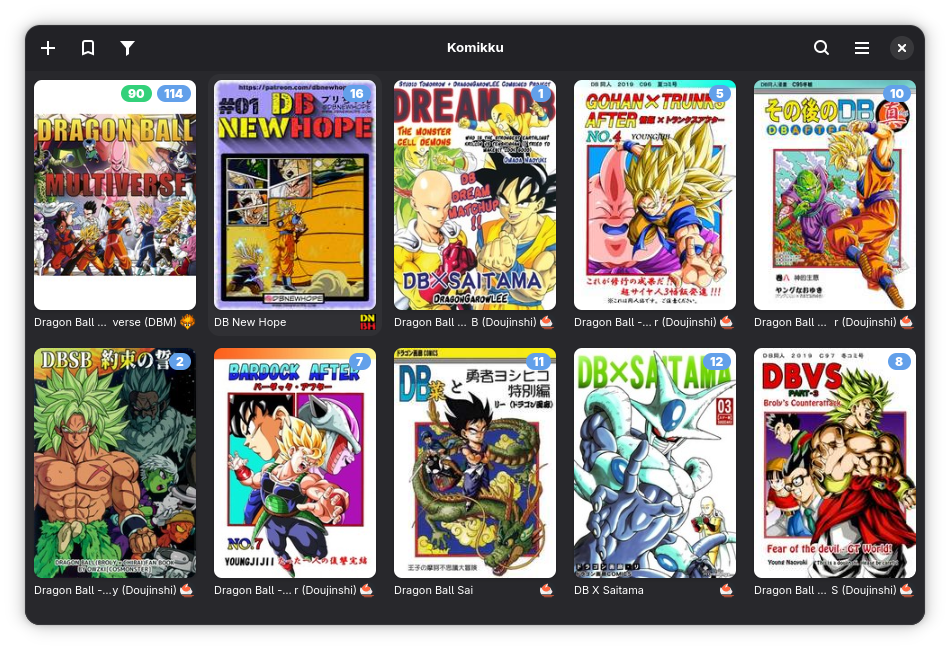

# <a href="https://apps.gnome.org/Komikku/">Komikku</a>

**Komikku** is a manga reader for [GNOME](https://www.gnome.org). It focuses on providing a clean, intuitive and adaptive interface.

## 📄 License

**Komikku** is licensed under the [GPLv3+](https://www.gnu.org/licenses/gpl-3.0.html).

## ✨ Keys features

* Online/Offline reading
* Support for locally stored series (in [CBZ/CBR/CBT](https://en.wikipedia.org/wiki/Comic_book_archive), EPUB and PDF formats)
* RTL (Right To Left), LTR (Left To Right), Vertical and Webtoon reading modes
* Several types of navigation:
  * Keyboard arrow keys
  * Right and left navigation layout via mouse click or tapping (touchpad/touch screen)
  * Mouse wheel
  * 2-fingers swipe gesture (touchpad)
  * Swipe gesture (touch screen)
* Categories to organize your library
* Automatic tracking of series with [AniList](https://anilist.co/), [MangaUpdates](https://www.mangaupdates.com) and [MyAnimeList](https://myanimelist.net/)
* Automatic update of series
* Automatic download of new chapters
* Reading history
* Light and dark themes

## 📸 Screenshot

## 🚀 Installation

### Flatpak

### Native package

**Komikku** is available as native package in the repositories of the following distributions:

## 👨‍💻 Contributing

### Code

Please follow our [contributing guidelines](CONTRIBUTING.md).

### Code of Conduct

We follow the [GNOME Code of Conduct](https://conduct.gnome.org/).
All communications in project spaces are expected to follow it.

### Use of Generative AI

This project does not allow contributions generated by large languages models (LLMs) and chatbots. This ban includes, but is not limited to, tools like ChatGPT, Claude, Copilot, DeepSeek, and Devin AI. We are taking these steps as precaution due to the potential negative influence of AI generated content on quality, as well as likely copyright violations or its environmental impact.

This ban of AI generated content applies to all parts of the projects, including, but not limited to, code, documentation, issues, and artworks. An exception applies for purely translating texts for issues and comments to English.

AI tools can be used to answer questions and find information. However, we encourage contributors to avoid them in favor of using [existing documentation and our chat](https://welcome.gnome.org/app/Komikku/). Since AI generated information is frequently misleading or false, we cannot supply support on anything referencing AI output.

### Translations

If you'd like to help translating **Komikku** into your language, please head over to [Weblate](https://hosted.weblate.org/engage/komikku/).

## 💖 Sponsor this project

**Komikku** is a `Free software`. If you like it and would like to support and fund it, you may donate through one of the plateform below. Any amount will be greatly appreciated 🤩.

| Plateforms | | |
|:---:|:--:|--|
| Liberapay | | Weekly/monthly/yearly donation |
| PayPal |  | One-time donation |
| Ko-fi |  | One-time or monthly donation |
| ₿itcoin | bc1qzq2ve4c44hu7kzgjth3gmq0tnyl33eltlvudcw | One-time donation |

Can't sponsor right now? No problem — you can still help a lot by:
- ⭐ Starring this repository
- 🐛 Giving feedback or reporting issues
- 💡 Suggesting new features or new servers
- 🔄 Sharing on social media

## 💡 About the name

Komikku (コミック) is a Japanese word meaning `Comics`.

## ⚠️ Disclaimer

- The developers of this application does not have any affiliation with the content providers available.
- The application itself has no content and can be considered as a browser-like app.
